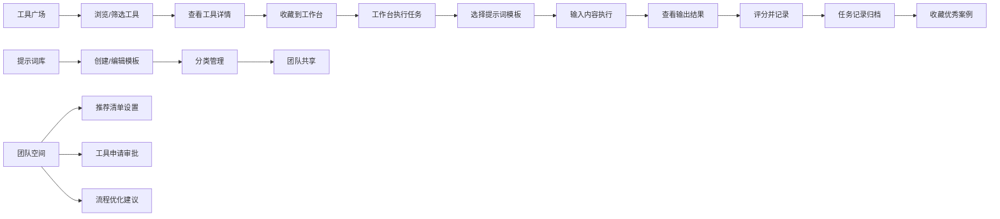

## 1. 产品概述

AI 工具箱是面向内容团队的一站式 AI 服务管理平台，集中管理写作、配图、翻译和资料整理等常用 AI 工具，提升团队协作效率与内容产出质量。

- **核心价值**：整合分散的 AI 服务入口，提供统一的工作台、提示词管理、任务记录和团队协作能力
- **目标用户**：内容运营、文案策划、设计师、翻译人员、市场团队等内容创作者
- **解决问题**：AI 工具入口分散、提示词难以沉淀、产出结果无法追溯、团队协作效率低

## 2. 核心功能

### 2.1 用户角色

| 角色 | 说明 | 核心权限 |
|------|------|----------|
| 普通成员 | 团队普通用户 | 使用工具、管理个人提示词、查看任务记录 |
| 团队管理员 | 团队管理者 | 设置团队推荐、管理成员、审批工具申请 |

### 2.2 功能模块

1. **工具广场**：浏览所有可用 AI 工具，按分类/岗位筛选，查看工具详情与额度
2. **工作台**：快速访问常用工具，组合工具形成工作流，执行 AI 任务
3. **提示词库**：管理提示词模板，分类收藏，团队共享
4. **任务记录**：历史产出记录，人工评分，收藏优秀案例
5. **团队空间**：团队推荐清单，工具申请，成员管理，流程优化建议

### 2.3 页面详情

| 页面名称 | 模块名称 | 功能描述 |
|-----------|-------------|---------------------|
| 工具广场 | 分类导航 | 按写作、配图、翻译、整理分类筛选工具 |
| 工具广场 | 工具卡片 | 展示工具名称、图标、简介、评分、额度状态 |
| 工具广场 | 岗位推荐 | 按岗位角色推荐适合的工具组合 |
| 工具广场 | 工具详情 | 工具介绍、使用说明、额度与到期时间、API 配置 |
| 工作台 | 快捷入口 | 常用工具收藏、快速启动 |
| 工作台 | 工作流编辑器 | 拖拽组合多个工具形成流程，设置参数传递 |
| 工作台 | 任务执行区 | 输入内容、选择提示词、执行 AI 任务、实时查看结果 |
| 提示词库 | 分类管理 | 创建分类、拖拽排序、搜索过滤 |
| 提示词库 | 模板编辑 | 新建/编辑提示词模板，变量占位符，使用示例 |
| 提示词库 | 团队共享 | 设置模板可见范围，推荐为团队模板 |
| 任务记录 | 历史列表 | 按时间/工具/评分筛选，分页浏览 |
| 任务记录 | 详情查看 | 查看完整输入输出、所用提示词、耗时、消耗额度 |
| 任务记录 | 评分收藏 | 五星评分、添加评语、收藏优秀案例 |
| 团队空间 | 推荐清单 | 管理员设置团队推荐工具和提示词 |
| 团队空间 | 工具申请 | 提交新工具申请，查看审批状态 |
| 团队空间 | 成员管理 | 查看团队成员、角色、使用统计 |
| 团队空间 | 流程建议 | 智能分析重复/低效流程，给出优化建议 |

## 3. 核心流程

### 3.1 主要用户流程

用户进入应用后，可在工具广场浏览所有 AI 工具，按分类或岗位筛选找到适合的工具；将常用工具收藏到工作台快速访问；使用提示词库管理和复用优质提示词模板；在工作台执行单个工具或组合工作流完成任务；所有产出自动记录到任务记录，可评分和收藏；团队管理员在团队空间管理推荐工具、审批新工具申请，并查看流程优化建议。

### 3.2 流程图

## 4. 用户界面设计

### 4.1 设计风格

- **设计调性**：现代简约 + 科技质感，采用深色主题为主，突出工具类产品的专业感和效率感
- **主色调**：深邃蓝紫渐变作为主色，搭配青绿色作为强调色
- **辅助色**：使用琥珀色表示警告、翠绿色表示成功、玫红色表示错误
- **字体**：标题使用现代无衬线字体，正文使用清晰易读的等宽友好字体
- **布局**：左侧导航 + 主内容区 + 右侧详情面板的三栏布局
- **卡片风格**：微玻璃拟态效果，细微边框，悬浮阴影变化
- **图标**：线性图标，统一粗细，配合彩色背景小圆点

### 4.2 页面设计概览

| 页面名称 | 模块名称 | UI 元素 |
|-----------|-------------|----------|
| 工具广场 | 顶部搜索栏 | 搜索框、分类标签切换、岗位筛选下拉 |
| 工具广场 | 工具网格 | 卡片式布局，悬浮放大效果，渐变图标背景 |
| 工具广场 | 侧边筛选 | 分类树、标签筛选、额度状态过滤 |
| 工作台 | 快捷入口区 | 大图标快捷方式，拖拽排序 |
| 工作台 | 工作流画布 | 节点式编辑器，连线动画，参数配置面板 |
| 工作台 | 执行面板 | 分栏布局，左侧输入右侧输出，实时打字效果 |
| 提示词库 | 左侧分类 | 可折叠分类树，计数徽章 |
| 提示词库 | 中间列表 | 卡片列表，标题+摘要+标签 |
| 提示词库 | 右侧编辑器 | 富文本编辑，变量高亮，预览模式 |
| 任务记录 | 时间线 | 垂直时间线布局，日期分组 |
| 任务记录 | 记录卡片 | 工具图标、输入摘要、评分星星、收藏按钮 |
| 团队空间 | 概览卡片 | 数据统计卡片网格，指标数字动画 |
| 团队空间 | 建议列表 | 带图标的建议卡片，优先级标签 |

### 4.3 响应式

- 采用桌面优先设计，适配 1440px 及以上宽度
- 平板端：右侧详情面板变为底部抽屉
- 移动端：左侧导航变为汉堡菜单，卡片单列布局
- 触摸优化：增加点击区域，支持滑动手势操作

### 4.4 动效设计

- 页面切换：淡入淡出 + 轻微位移动画
- 卡片悬浮：上移 4px + 阴影加深 + 边框高亮
- 按钮点击：缩放 0.96 的微回弹效果
- 数据加载：骨架屏脉冲动画
- 工作流连线：流动光效动画
- 结果输出：逐字打字效果
