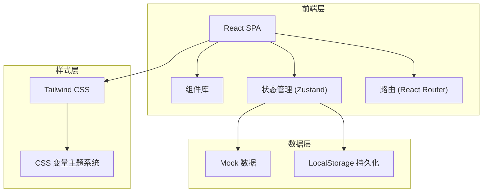
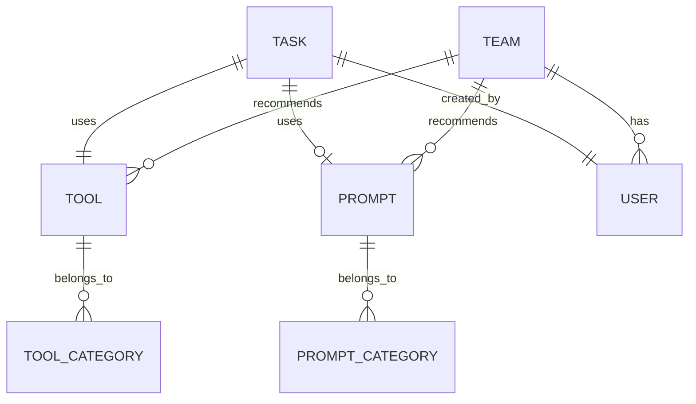

## 1. 架构设计



## 2. 技术描述

- **前端框架**：React 18 + TypeScript
- **构建工具**：Vite
- **路由管理**：react-router-dom v6
- **状态管理**：Zustand
- **样式方案**：Tailwind CSS 3 + CSS 变量
- **图标库**：lucide-react
- **数据方案**：Mock 数据 + LocalStorage 本地持久化
- **初始化工具**：vite-init react-ts 模板

## 3. 目录结构

```
src/
├── components/          # 通用组件
│   ├── layout/         # 布局组件
│   │   ├── Sidebar.tsx
│   │   └── Header.tsx
│   ├── ui/             # 基础 UI 组件
│   │   ├── Button.tsx
│   │   ├── Card.tsx
│   │   ├── Badge.tsx
│   │   ├── Input.tsx
│   │   ├── Modal.tsx
│   │   ├── Tabs.tsx
│   │   └── Tooltip.tsx
│   └── features/       # 业务组件
│       ├── ToolCard.tsx
│       ├── PromptCard.tsx
│       ├── TaskRecord.tsx
│       └── WorkflowNode.tsx
├── pages/              # 页面组件
│   ├── ToolSquare.tsx
│   ├── Workbench.tsx
│   ├── PromptLibrary.tsx
│   ├── TaskRecords.tsx
│   └── TeamSpace.tsx
├── store/              # 状态管理
│   ├── useToolStore.ts
│   ├── usePromptStore.ts
│   ├── useTaskStore.ts
│   └── useTeamStore.ts
├── data/               # Mock 数据
│   ├── tools.ts
│   ├── prompts.ts
│   ├── tasks.ts
│   └── team.ts
├── types/              # 类型定义
│   └── index.ts
├── utils/              # 工具函数
│   ├── helpers.ts
│   └── constants.ts
├── App.tsx
├── main.tsx
└── index.css
```

## 4. 路由定义

| 路由 | 页面 | 说明 |
|-------|------|------|
| / | 工作台 | 默认首页，快捷入口和工作流 |
| /tools | 工具广场 | 浏览和筛选所有 AI 工具 |
| /tools/:id | 工具详情 | 工具详情与额度信息 |
| /workbench | 工作台 | 任务执行与工作流编辑 |
| /prompts | 提示词库 | 提示词模板管理 |
| /tasks | 任务记录 | 历史产出与评分 |
| /team | 团队空间 | 团队管理与优化建议 |

## 5. 数据模型

### 5.1 实体关系图



### 5.2 数据类型定义

```typescript
// 工具
interface Tool {
  id: string;
  name: string;
  description: string;
  icon: string;
  category: string;
  tags: string[];
  quota: {
    total: number;
    used: number;
    unit: string;
  };
  expiryDate: string;
  rating: number;
  useCount: number;
  isFavorite: boolean;
  isTeamRecommended: boolean;
  suitableRoles: string[];
}

// 提示词模板
interface Prompt {
  id: string;
  title: string;
  content: string;
  variables: string[];
  category: string;
  tags: string[];
  isFavorite: boolean;
  isTeamShared: boolean;
  useCount: number;
  createdAt: string;
  updatedAt: string;
}

// 任务记录
interface TaskRecord {
  id: string;
  toolId: string;
  toolName: string;
  promptId?: string;
  promptTitle?: string;
  input: string;
  output: string;
  rating: number; // 0-5
  isFavorite: boolean;
  comment?: string;
  duration: number; // 秒
  quotaUsed: number;
  createdAt: string;
  createdBy: string;
}

// 工作流
interface Workflow {
  id: string;
  name: string;
  description: string;
  nodes: WorkflowNode[];
  edges: WorkflowEdge[];
  isFavorite: boolean;
  useCount: number;
}

// 团队成员
interface TeamMember {
  id: string;
  name: string;
  avatar: string;
  role: 'member' | 'admin';
  position: string;
  joinDate: string;
  taskCount: number;
}

// 工具申请
interface ToolRequest {
  id: string;
  name: string;
  reason: string;
  applicantId: string;
  applicantName: string;
  status: 'pending' | 'approved' | 'rejected';
  createdAt: string;
}

// 流程建议
interface FlowSuggestion {
  id: string;
  title: string;
  description: string;
  type: 'duplicate' | 'inefficient' | 'optimization';
  priority: 'high' | 'medium' | 'low';
  relatedTools: string[];
  suggestion: string;
}
```

## 6. 状态管理设计

使用 Zustand 管理全局状态，按领域拆分为多个 store：

- **useToolStore**: 工具列表、筛选条件、收藏状态
- **usePromptStore**: 提示词模板、分类管理
- **useTaskStore**: 任务记录、评分、收藏
- **useTeamStore**: 团队信息、成员、推荐设置

## 7. 核心技术决策

1. **纯前端 + Mock 数据**：由于是演示项目，不搭建后端服务，使用 Mock 数据 + LocalStorage 模拟持久化
2. **Zustand 状态管理**：轻量级、API 简洁，适合中大型应用
3. **Tailwind CSS**：快速构建统一的设计系统
4. **组件化设计**：基础 UI 组件 + 业务组件分层
5. **响应式布局**：桌面优先，兼顾平板和移动端
6. **CSS 变量主题**：支持深色/浅色主题切换
